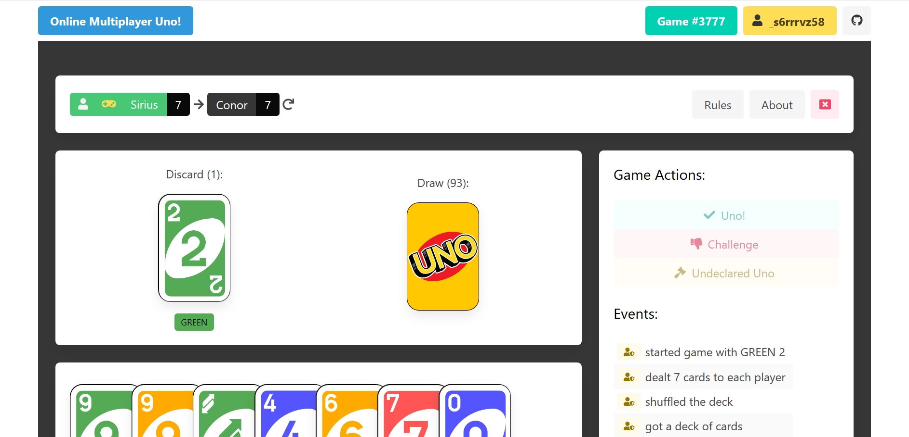

# Online Multiplayer Uno

## With House Rules!

### A fun project, written by Conor Riches

## Running

This project is built with React and NodeJS.
The card images are from Wikipedia.
House rules are enforced!

### Prerequisites

- You'll need NodeJS installed which includes npm.
- [Install pm2 globally](https://www.npmjs.com/package/pm2)

### Installing

- Clone
- `cd online-multiplayer-uno`
- `npm i`
  - this installs `node_modules`
- `npm run build`
  - this creates performant client code
- `npm start`
  - under the hood this runs `pm2 [start|restart|stop] ecosystem.config.js --env production`
  - this will keep the server up and running
  - run `pm2 list` to keep an eye for any restarts (indicating an error)
- Visit the URL - default is `localhost:5000` for dev and port 80 for production.

## Development

This uses websockets for communication.

`/src/server/index.js` is where the fun starts.

When running locally, you need to run both the server and client separately:

- This enables hot reloading of your work, so no need to refresh
- Also means you don't need to run `npm build` every time you make a change
